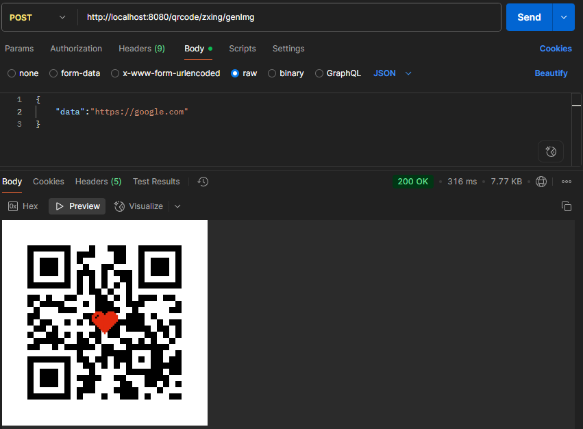

# QR CODE LOVER
Aplicação para gerar QRCode a partir de texto.

## Tecnologias
- Java 17
- Spring Boot
- Bibliotecas: QR Code Generator e Zxing

## Rodando localmente

Clone o projeto

```bash
  git clone https://github.com/larifar/qrcodelover
```

Entre no diretório do projeto

```bash
  cd qrcodelover
```

Compile o projeto

```bash
  ./mvnw clean install
```

Inicie o servidor

```bash
  ./mvnw spring-boot:run
```

O servidor estará disponível em: http://localhost:8080


## Funcionalidades

- Gerar QR Code a partir de texto
- Opção de QR Code com coração no meio


## Como usar

Requisições:
- GET:
  Retornam imagem PNG:
    - /qrcode/nayuki/{texto} — Gera QR Code com a biblioteca Nayuki
    - /qrcode/zxing/{texto} — Gera QR Code com a biblioteca ZXing
- POST: Envie JSON com campo data (String):
    - /qrcode/nayuki/gen — Gera QR Code (Nayuki)
    - /qrcode/zxing/gen — Gera QR Code (ZXing)
    - /qrcode/zxing/genImg — Gera QR Code com coração no meio (ZXing)


## Exemplo no Postman



### Links úteis
- [Bibliotecas para gerar QrCode com Java](https://www.baeldung.com/java-generating-barcodes-qr-codes)
- [Documentação Biblioteca Zxing](https://github.com/zxing/zxing)
- [Documentação Biblioteca Qr Code Generator](https://github.com/nayuki/QR-Code-generator)